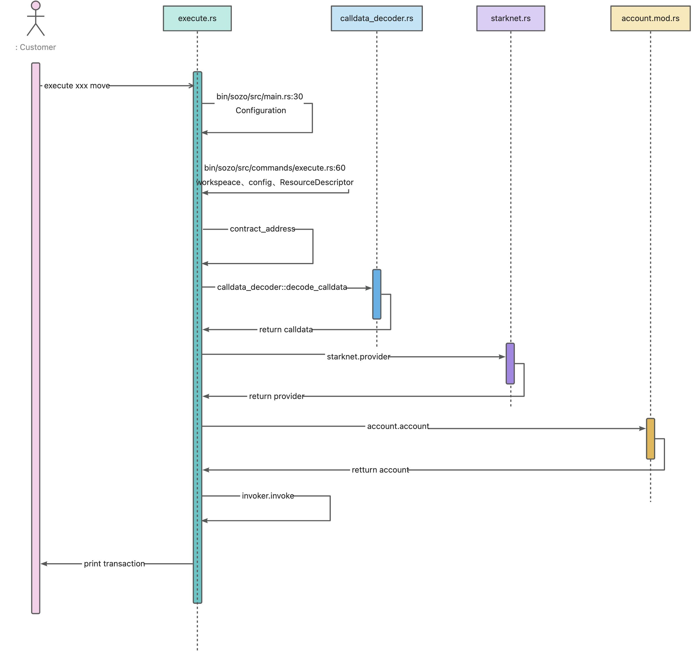

# dojo 命令时图

## sozo execute 的执行时序图



trace 日志

```bash
2024-12-18T08:08:40.258199Z TRACE sozo: Configuration built successfully. manifest_path=/Users/zhengpeng/Source/Code/Rust-Code/Github/dojo/Scarb.toml
2024-12-18T08:08:40.258408Z TRACE Subcommand{name="Execute"}: sozo::commands::execute: args=ExecuteArgs { tag_or_address: Address(0x58b83bea84766c5725c12e239c1ec9e1fde679ddf709b772fe7a8fdfd3cda27), entrypoint: "move", calldata: Some("1"), diff: false, starknet: StarknetOptions { rpc_url: None }, account: AccountOptions { account_address: None, controller: false, signer: SignerOptions { private_key: None, keystore_path: None, keystore_password: None }, legacy: false }, world: WorldOptions { world_address: None }, transaction: TransactionOptions { fee: Strk, fee_estimate_multiplier: None, max_fee_raw: None, gas: None, gas_price: None, wait: false, receipt: false, walnut: false } }
2024-12-18T08:08:40.263370Z TRACE Subcommand{name="Execute"}: sozo::commands::options::starknet: Retrieving RPC URL for StarknetOptions.
2024-12-18T08:08:40.263406Z TRACE Subcommand{name="Execute"}: sozo::commands::options::starknet: Using RPC URL from environment metadata. url="http://localhost:5050/"
2024-12-18T08:08:40.265041Z TRACE Subcommand{name="Execute"}: sozo::commands::execute: Executing Execute command. contract=Address(0x58b83bea84766c5725c12e239c1ec9e1fde679ddf709b772fe7a8fdfd3cda27) entrypoint="move" calldata=Some("1")
2024-12-18T08:08:40.265509Z TRACE Subcommand{name="Execute"}: sozo::commands::options::starknet: Retrieving RPC URL for StarknetOptions.
2024-12-18T08:08:40.265534Z TRACE Subcommand{name="Execute"}: sozo::commands::options::starknet: Using RPC URL from environment metadata. url="http://localhost:5050/"
2024-12-18T08:08:40.270337Z TRACE Subcommand{name="Execute"}: sozo::commands::options::account: Account address found in environment metadata. address="0x127fd5f1fe78a71f8bcd1fec63e3fe2f0486b6ecd5c86a0466c3a21fa5cfcec"
2024-12-18T08:08:40.270410Z TRACE Subcommand{name="Execute"}: sozo::commands::options::signer: Signing using private key from env metadata.
2024-12-18T08:08:40.270442Z TRACE Subcommand{name="Execute"}: sozo::commands::options::account: Fetching chain id...
2024-12-18T08:08:40.274130Z TRACE Subcommand{name="Execute"}: sozo::commands::options::account: chain_id=0x4b4154414e41
2024-12-18T08:08:40.274160Z TRACE Subcommand{name="Execute"}: sozo::commands::options::account: Creating SingleOwnerAccount. encoding=New
2024-12-18T08:08:40.274239Z TRACE Subcommand{name="Execute"}: dojo_utils::tx::invoker: Invoke contract. call=Call { to: 0x58b83bea84766c5725c12e239c1ec9e1fde679ddf709b772fe7a8fdfd3cda27, selector: 0x239e4c8fbd11b680d7214cfc26d1780d5c099453f0832beb15fd040aebd4ebb, calldata: [0x1] }
2024-12-18T08:08:40.274374Z TRACE Subcommand{name="Execute"}: dojo_utils::tx::invoker: Invoking with STRK. config=StrkFeeConfig { gas: None, gas_price: None }
2024-12-18T08:08:40.353172Z TRACE Subcommand{name="Execute"}: dojo_utils::tx::invoker: Invoke contract. transaction_hash="0x0408d04a39839c7b83e47ba443057e480b8860fe425651f01a337cb8fa4ea396"
Transaction hash: 0x0408d04a39839c7b83e47ba443057e480b8860fe425651f01a337cb8fa4ea396


```