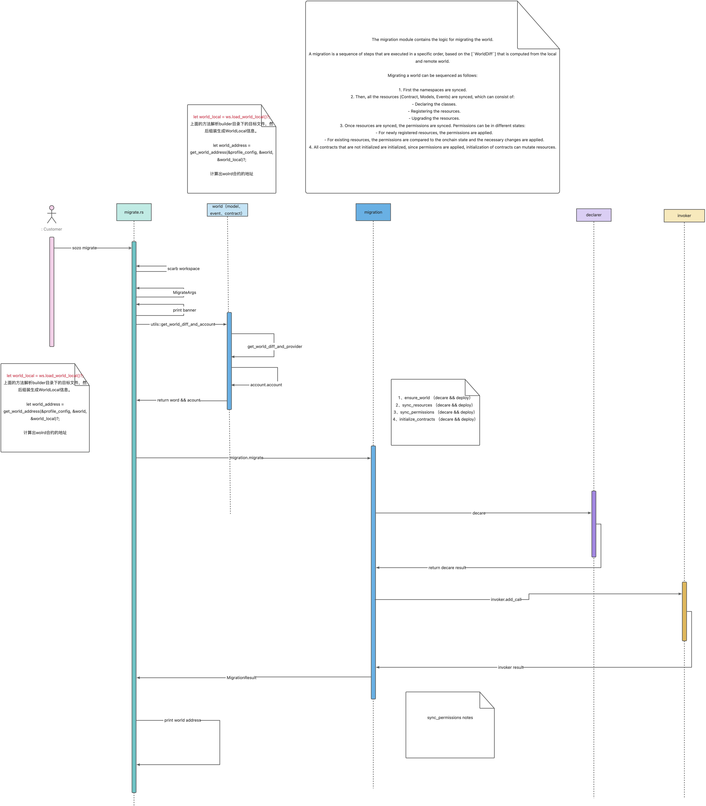
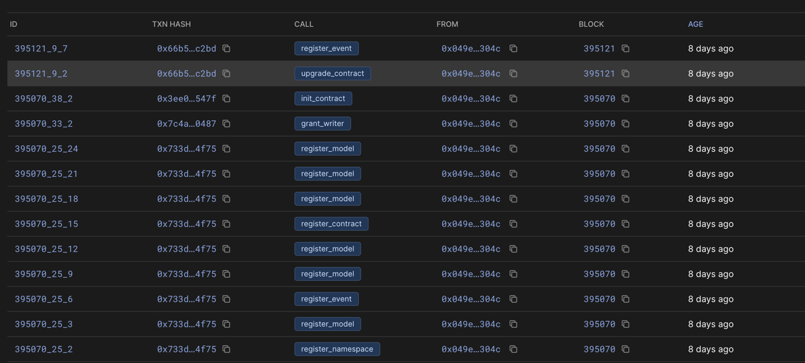
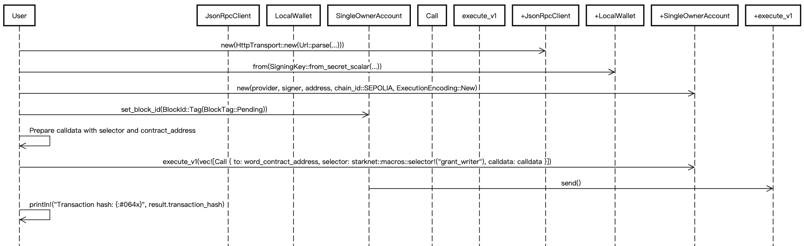

# dojo 命令时图

## sozo execute 的执行时序图


trace 日志

```bash
2024-12-18T08:08:40.258199Z TRACE sozo: Configuration built successfully. manifest_path=/Users/zhengpeng/Source/Code/Rust-Code/Github/dojo/Scarb.toml
2024-12-18T08:08:40.258408Z TRACE Subcommand{name="Execute"}: sozo::commands::execute: args=ExecuteArgs { tag_or_address: Address(0x58b83bea84766c5725c12e239c1ec9e1fde679ddf709b772fe7a8fdfd3cda27), entrypoint: "move", calldata: Some("1"), diff: false, starknet: StarknetOptions { rpc_url: None }, account: AccountOptions { account_address: None, controller: false, signer: SignerOptions { private_key: None, keystore_path: None, keystore_password: None }, legacy: false }, world: WorldOptions { world_address: None }, transaction: TransactionOptions { fee: Strk, fee_estimate_multiplier: None, max_fee_raw: None, gas: None, gas_price: None, wait: false, receipt: false, walnut: false } }
2024-12-18T08:08:40.263370Z TRACE Subcommand{name="Execute"}: sozo::commands::options::starknet: Retrieving RPC URL for StarknetOptions.
2024-12-18T08:08:40.263406Z TRACE Subcommand{name="Execute"}: sozo::commands::options::starknet: Using RPC URL from environment metadata. url="http://localhost:5050/"
2024-12-18T08:08:40.265041Z TRACE Subcommand{name="Execute"}: sozo::commands::execute: Executing Execute command. contract=Address(0x58b83bea84766c5725c12e239c1ec9e1fde679ddf709b772fe7a8fdfd3cda27) entrypoint="move" calldata=Some("1")
2024-12-18T08:08:40.265509Z TRACE Subcommand{name="Execute"}: sozo::commands::options::starknet: Retrieving RPC URL for StarknetOptions.
2024-12-18T08:08:40.265534Z TRACE Subcommand{name="Execute"}: sozo::commands::options::starknet: Using RPC URL from environment metadata. url="http://localhost:5050/"
2024-12-18T08:08:40.270337Z TRACE Subcommand{name="Execute"}: sozo::commands::options::account: Account address found in environment metadata. address="0x127fd5f1fe78a71f8bcd1fec63e3fe2f0486b6ecd5c86a0466c3a21fa5cfcec"
2024-12-18T08:08:40.270410Z TRACE Subcommand{name="Execute"}: sozo::commands::options::signer: Signing using private key from env metadata.
2024-12-18T08:08:40.270442Z TRACE Subcommand{name="Execute"}: sozo::commands::options::account: Fetching chain id...
2024-12-18T08:08:40.274130Z TRACE Subcommand{name="Execute"}: sozo::commands::options::account: chain_id=0x4b4154414e41
2024-12-18T08:08:40.274160Z TRACE Subcommand{name="Execute"}: sozo::commands::options::account: Creating SingleOwnerAccount. encoding=New
2024-12-18T08:08:40.274239Z TRACE Subcommand{name="Execute"}: dojo_utils::tx::invoker: Invoke contract. call=Call { to: 0x58b83bea84766c5725c12e239c1ec9e1fde679ddf709b772fe7a8fdfd3cda27, selector: 0x239e4c8fbd11b680d7214cfc26d1780d5c099453f0832beb15fd040aebd4ebb, calldata: [0x1] }
2024-12-18T08:08:40.274374Z TRACE Subcommand{name="Execute"}: dojo_utils::tx::invoker: Invoking with STRK. config=StrkFeeConfig { gas: None, gas_price: None }
2024-12-18T08:08:40.353172Z TRACE Subcommand{name="Execute"}: dojo_utils::tx::invoker: Invoke contract. transaction_hash="0x0408d04a39839c7b83e47ba443057e480b8860fe425651f01a337cb8fa4ea396"
Transaction hash: 0x0408d04a39839c7b83e47ba443057e480b8860fe425651f01a337cb8fa4ea396


```




trace 日志

```bash

2024-12-20T06:48:22.483425Z TRACE sozo: Configuration built successfully. manifest_path=/Users/zhengpeng/Work/Source/Code/rust-code/dojo/Scarb.toml
2024-12-20T06:48:22.483586Z TRACE Subcommand{name="Migrate"}: sozo::commands::migrate: args=MigrateArgs { transaction: TransactionOptions { fee: Strk, fee_estimate_multiplier: None, max_fee_raw: None, gas: None, gas_price: None, wait: false, receipt: false, walnut: false }, world: WorldOptions { world_address: None }, starknet: StarknetOptions { rpc_url: None }, account: AccountOptions { account_address: None, controller: false, signer: SignerOptions { private_key: None, keystore_path: None, keystore_password: None }, legacy: false }, ipfs: IpfsOptions { ipfs_url: None, ipfs_username: None, ipfs_password: None } }
2024-12-20T06:48:22.487833Z TRACE Subcommand{name="Migrate"}: sozo::commands::options::starknet: Retrieving RPC URL for StarknetOptions.
2024-12-20T06:48:22.487889Z TRACE Subcommand{name="Migrate"}: sozo::commands::options::starknet: Using RPC URL from environment metadata. url="http://localhost:5050/"
2024-12-20T06:48:22.498534Z TRACE Subcommand{name="Migrate"}: dojo_utils::provider: Provider health check. latest_block=Block(BlockWithTxHashes { status: AcceptedOnL1, block_hash: 0x607578c124baf60f2746ee38c8eeae659a707865aa08b7fc8ad3615da8b7d27, parent_hash: 0x0, block_number: 0, new_root: 0x0, timestamp: 0, sequencer_address: 0x1, l1_gas_price: ResourcePrice { price_in_fri: 0x0, price_in_wei: 0x0 }, l1_data_gas_price: ResourcePrice { price_in_fri: 0x0, price_in_wei: 0x0 }, l1_da_mode: Calldata, starknet_version: "0.13.1.1", transactions: [] })

 profile | chain_id | rpc_url                
---------+----------+------------------------
 dev     | KATANA   | http://localhost:5050/ 

⛩️  Evaluating world diff...2024-12-20T06:48:22.501841Z TRACE Subcommand{name="Migrate"}: dojo_world::local::artifact_to_local: Loading world from directory. profile_config=ProfileConfig { world: WorldConfig { name: "Dojo starter", seed: "dojo_starter", description: Some("The official Dojo Starter guide, the quickest and most streamlined way to get your Dojo Autonomous World up and running. This guide will assist you with the initial setup, from cloning the repository to deploying your world."), cover_uri: Some(File("assets/cover.png")), icon_uri: Some(File("assets/icon.png")), website: Some(Url { scheme: "https", cannot_be_a_base: false, username: "", password: None, host: Some(Domain("github.com")), port: None, path: "/dojoengine/dojo-starter", query: None, fragment: None }), socials: Some({"discord": "https://discord.gg/FB2wR6uF", "telegram": "https://t.me/dojoengine", "github": "https://github.com/dojoengine/dojo-starter", "x": "https://x.com/ohayo_dojo"}) }, models: None, contracts: None, events: None, namespace: NamespaceConfig { default: "dojo_starter", mappings: None }, env: Some(Environment { rpc_url: Some("http://localhost:5050/"), account_address: Some("0x127fd5f1fe78a71f8bcd1fec63e3fe2f0486b6ecd5c86a0466c3a21fa5cfcec"), private_key: Some("0xc5b2fcab997346f3ea1c00b002ecf6f382c5f9c9659a3894eb783c5320f912"), keystore_path: None, keystore_password: None, world_address: None, world_block: None, http_headers: None, ipfs_config: None }), migration: None, writers: Some({"dojo_starter": {"dojo_starter-actions"}}), owners: None, init_call_args: None } directory=/Users/zhengpeng/Work/Source/Code/rust-code/dojo/target/dev
🗡️  Evaluating world diff...2024-12-20T06:48:23.573478Z TRACE Subcommand{name="Migrate"}: dojo_world::local::artifact_to_local: Adding local model from artifact. name="Position" namespace="dojo_starter"
🥷  Evaluating world diff...2024-12-20T06:48:24.921273Z TRACE Subcommand{name="Migrate"}: dojo_world::local::artifact_to_local: Adding local model from artifact. name="Moves" namespace="dojo_starter"
🗡️  Evaluating world diff...2024-12-20T06:48:44.798392Z TRACE Subcommand{name="Migrate"}: dojo_world::local::artifact_to_local: Adding local event from artifact. name="Moved" namespace="dojo_starter"
🥷  Evaluating world diff...2024-12-20T06:48:45.944394Z TRACE Subcommand{name="Migrate"}: dojo_world::local::artifact_to_local: Adding local model from artifact. name="DirectionsAvailable" namespace="dojo_starter"
🗡️  Evaluating world diff...2024-12-20T06:48:49.215747Z TRACE Subcommand{name="Migrate"}: dojo_world::local::artifact_to_local: Adding local contract from artifact. name="actions" namespace="dojo_starter"
2024-12-20T06:48:49.228105Z TRACE Subcommand{name="Migrate"}: sozo::commands::options::world: No world address found.
2024-12-20T06:48:49.228157Z TRACE Subcommand{name="Migrate"}: sozo::commands::options::starknet: Retrieving RPC URL for StarknetOptions.
2024-12-20T06:48:49.228173Z TRACE Subcommand{name="Migrate"}: sozo::commands::options::starknet: Using RPC URL from environment metadata. url="http://localhost:5050/"
2024-12-20T06:48:49.230857Z TRACE Subcommand{name="Migrate"}: dojo_utils::provider: Provider health check. latest_block=Block(BlockWithTxHashes { status: AcceptedOnL1, block_hash: 0x607578c124baf60f2746ee38c8eeae659a707865aa08b7fc8ad3615da8b7d27, parent_hash: 0x0, block_number: 0, new_root: 0x0, timestamp: 0, sequencer_address: 0x1, l1_gas_price: ResourcePrice { price_in_fri: 0x0, price_in_wei: 0x0 }, l1_data_gas_price: ResourcePrice { price_in_fri: 0x0, price_in_wei: 0x0 }, l1_da_mode: Calldata, starknet_version: "0.13.1.1", transactions: [] })
2024-12-20T06:48:49.230935Z TRACE Subcommand{name="Migrate"}: sozo::utils: Provider initialized. provider=JsonRpcClient { transport: HttpTransport { client: Client { accepts: Accepts { gzip: true, brotli: true, deflate: true }, proxies: [Proxy(System({"http": http://127.0.0.1:7890, "https": http://127.0.0.1:7890}), None)], referer: true, default_headers: {"accept": "*/*"}, timeout: 30s }, url: Url { scheme: "http", cannot_be_a_base: false, username: "", password: None, host: Some(Domain("localhost")), port: Some(5050), path: "/", query: None, fragment: None }, headers: [] } }
2024-12-20T06:48:49.233092Z TRACE Subcommand{name="Migrate"}: sozo::utils: spec_version="0.7.1"
2024-12-20T06:48:49.235055Z TRACE Subcommand{name="Migrate"}: sozo::utils: chain_id="KATANA"
                                 
2024-12-20T06:48:49.596777Z TRACE Subcommand{name="Migrate"}: dojo_world::contracts::contract_info: Converting world diff to contracts info.
2024-12-20T06:48:49.600354Z TRACE Subcommand{name="Migrate"}: sozo::commands::options::account: Account address found in environment metadata. address="0x127fd5f1fe78a71f8bcd1fec63e3fe2f0486b6ecd5c86a0466c3a21fa5cfcec"
2024-12-20T06:48:49.600408Z TRACE Subcommand{name="Migrate"}: sozo::commands::options::signer: Signing using private key from env metadata.
2024-12-20T06:48:49.600436Z TRACE Subcommand{name="Migrate"}: sozo::commands::options::account: Fetching chain id...
2024-12-20T06:48:49.602502Z TRACE Subcommand{name="Migrate"}: sozo::commands::options::account: chain_id=0x4b4154414e41
2024-12-20T06:48:49.602563Z TRACE Subcommand{name="Migrate"}: sozo::commands::options::account: Creating SingleOwnerAccount. encoding=New
⛩️  Verifying account...2024-12-20T06:48:49.604588Z TRACE Subcommand{name="Migrate"}: dojo_utils::tx::deployer: Contract already deployed. contract_address="0x0127fd5f1fe78a71f8bcd1fec63e3fe2f0486b6ecd5c86a0466c3a21fa5cfcec"
2024-12-20T06:48:50.105980Z TRACE Subcommand{name="Migrate"}: sozo_ops::migrate: Deploying the first world.
🥷  Deploying the world...2024-12-20T06:48:52.432167Z TRACE Subcommand{name="Migrate"}: dojo_utils::tx::declarer: Declaring class. label="world" class_hash="0x079d9ce84b97bcc2a631996c3100d57966fc2f5b061fb1ec4dfd0040976bcac6" casm_class_hash="0x0149397d4ee0e1895700b62c74d73a1314f53924b1f76d9cd2cf4d865c18abd0"
⛩️  Deploying the world...2024-12-20T06:48:59.404142Z TRACE Subcommand{name="Migrate"}: dojo_utils::tx::declarer: Declared class. label="world" transaction_hash="0x02609dd2c2c3d56d0bfea9f2ffedf9db211ca53fba02c9d8d7ce3ebe24820b61" class_hash="0x079d9ce84b97bcc2a631996c3100d57966fc2f5b061fb1ec4dfd0040976bcac6" casm_class_hash="0x0149397d4ee0e1895700b62c74d73a1314f53924b1f76d9cd2cf4d865c18abd0"
🗡️  Deploying the world...2024-12-20T06:49:01.920932Z TRACE Subcommand{name="Migrate"}: dojo_utils::tx::deployer: Deploying with STRK.
2024-12-20T06:49:02.054984Z TRACE Subcommand{name="Migrate"}: dojo_utils::tx::deployer: Deployed contract via UDC. transaction_hash="0x038e984efa3e91e045b33d14e63c5e9f765e5a8fe2b3546fc3ab872f608e37a2" contract_address="0x00e2ea9b5dd9804d13903edf712998943b7d5d606c139dd0f13eeb8f5b84da8d"
🌍 World deployed at block 2 with txn hash: 0x038e984efa3e91e045b33d14e63c5e9f765e5a8fe2b3546fc3ab872f608e37a2
2024-12-20T06:49:04.668041Z TRACE Subcommand{name="Migrate"}: sozo_ops::migrate: Registering namespace. name="dojo_starter"
⛩️  Syncing resources...2024-12-20T06:49:04.668275Z TRACE Subcommand{name="Migrate"}: sozo_ops::migrate: Registering model. namespace="dojo_starter" name="Position" class_hash="0x02283c68ecba5c60bbbbd3b00659808a02244468e41a1d2cdba1312d65b83594"
2024-12-20T06:49:04.669787Z TRACE Subcommand{name="Migrate"}: sozo_ops::migrate: Registering model. namespace="dojo_starter" name="Moves" class_hash="0x070edf8f3be0b118e78f856f3ea9ebb652cba3684abaf7f299bfa6f93bf907c9"
2024-12-20T06:49:04.671261Z TRACE Subcommand{name="Migrate"}: sozo_ops::migrate: Registering model. namespace="dojo_starter" name="DirectionsAvailable" class_hash="0x07deb48ccf95cc441a0489cfefdae54aeb6f8ec462ba13ff25e23f080e66cc2f"
2024-12-20T06:49:04.672415Z TRACE Subcommand{name="Migrate"}: sozo_ops::migrate: Registering event. namespace="dojo_starter" name="Moved" class_hash="0x05be0a05a5df3bd3b4fc17f8b1feb395cb463ced20ea41d4fbb9b86a4d7efc66"
2024-12-20T06:49:04.673394Z TRACE Subcommand{name="Migrate"}: sozo_ops::migrate: Registering contract. namespace="dojo_starter" name="actions" class_hash="0x03f87eccb39c9dc7bb70d372350f4360ae1ff9da43bd72c89a96e336402a569b"
2024-12-20T06:49:04.681290Z TRACE Subcommand{name="Migrate"}: sozo_ops::migrate: Declaring classes with 10 accounts.
🥷  Declaring 5 classes with 10 accounts...2024-12-20T06:49:06.147192Z TRACE Subcommand{name="Migrate"}: dojo_utils::tx::declarer: Declaring class. label="dojo_starter-DirectionsAvailable" class_hash="0x07deb48ccf95cc441a0489cfefdae54aeb6f8ec462ba13ff25e23f080e66cc2f" casm_class_hash="0x06120953950d2ae97d6a36829008b9437c3a539c548d57b732ac208a53bd13f2"
2024-12-20T06:49:06.147695Z TRACE Subcommand{name="Migrate"}: dojo_utils::tx::declarer: Declaring class. label="dojo_starter-actions" class_hash="0x03f87eccb39c9dc7bb70d372350f4360ae1ff9da43bd72c89a96e336402a569b" casm_class_hash="0x02afbe0c5916f984e029bc9797fadff303ce6368cb6a77144f49e4e4454beb39"
2024-12-20T06:49:06.148032Z TRACE Subcommand{name="Migrate"}: dojo_utils::tx::declarer: Declaring class. label="dojo_starter-Position" class_hash="0x02283c68ecba5c60bbbbd3b00659808a02244468e41a1d2cdba1312d65b83594" casm_class_hash="0x0717bb52f95a3ccaa1d5b706e05bd239ef24e7c6e4f0a99c9c2c80d5fb496ca9"
2024-12-20T06:49:06.148356Z TRACE Subcommand{name="Migrate"}: dojo_utils::tx::declarer: Declaring class. label="dojo_starter-Moved" class_hash="0x05be0a05a5df3bd3b4fc17f8b1feb395cb463ced20ea41d4fbb9b86a4d7efc66" casm_class_hash="0x049d95d47646b658b138d866a952205216c0425a0ec41de24ab897f079103e60"
2024-12-20T06:49:06.148696Z TRACE Subcommand{name="Migrate"}: dojo_utils::tx::declarer: Declaring class. label="dojo_starter-Moves" class_hash="0x070edf8f3be0b118e78f856f3ea9ebb652cba3684abaf7f299bfa6f93bf907c9" casm_class_hash="0x0635f79fdb83c527369633e1b2c6febb2e3500a5f04bc4a68098b1b13a28b71a"
⛩️  Declaring 5 classes with 10 accounts...2024-12-20T06:49:08.434014Z TRACE Subcommand{name="Migrate"}: dojo_utils::tx::declarer: Declared class. label="dojo_starter-Moved" transaction_hash="0x02ed0370ad8735574fff3d6513ef02e4ed6674ca2edbf4d73cb887955e112fa1" class_hash="0x05be0a05a5df3bd3b4fc17f8b1feb395cb463ced20ea41d4fbb9b86a4d7efc66" casm_class_hash="0x049d95d47646b658b138d866a952205216c0425a0ec41de24ab897f079103e60"
2024-12-20T06:49:08.445330Z TRACE Subcommand{name="Migrate"}: dojo_utils::tx::declarer: Declared class. label="dojo_starter-Position" transaction_hash="0x0329e5ca89a363f4c5af427f320894d644b1955dd4bf8e4d79b0c96285e8f472" class_hash="0x02283c68ecba5c60bbbbd3b00659808a02244468e41a1d2cdba1312d65b83594" casm_class_hash="0x0717bb52f95a3ccaa1d5b706e05bd239ef24e7c6e4f0a99c9c2c80d5fb496ca9"
2024-12-20T06:49:08.455448Z TRACE Subcommand{name="Migrate"}: dojo_utils::tx::declarer: Declared class. label="dojo_starter-DirectionsAvailable" transaction_hash="0x03c9a1dd6e1b6db1e2aac135cb94b4999a63c7674418c40cec27c8984ea0b1cf" class_hash="0x07deb48ccf95cc441a0489cfefdae54aeb6f8ec462ba13ff25e23f080e66cc2f" casm_class_hash="0x06120953950d2ae97d6a36829008b9437c3a539c548d57b732ac208a53bd13f2"
2024-12-20T06:49:08.484089Z TRACE Subcommand{name="Migrate"}: dojo_utils::tx::declarer: Declared class. label="dojo_starter-Moves" transaction_hash="0x045637cb15245c1dfcd37f2515bfb674d98a06a77f1b7f7189ce181bb01ff88e" class_hash="0x070edf8f3be0b118e78f856f3ea9ebb652cba3684abaf7f299bfa6f93bf907c9" casm_class_hash="0x0635f79fdb83c527369633e1b2c6febb2e3500a5f04bc4a68098b1b13a28b71a"
2024-12-20T06:49:08.573807Z TRACE Subcommand{name="Migrate"}: dojo_utils::tx::declarer: Declared class. label="dojo_starter-actions" transaction_hash="0x01444cf2de00600c69383a66ba162b67317156e5a2fad9a6d3470fbbb518891b" class_hash="0x03f87eccb39c9dc7bb70d372350f4360ae1ff9da43bd72c89a96e336402a569b" casm_class_hash="0x02afbe0c5916f984e029bc9797fadff303ce6368cb6a77144f49e4e4454beb39"
⛩️  Registering 5 resources...2024-12-20T06:49:11.198652Z TRACE Subcommand{name="Migrate"}: dojo_utils::tx::invoker: Invoke contract multicall. self.calls=[Call { to: 0xe2ea9b5dd9804d13903edf712998943b7d5d606c139dd0f13eeb8f5b84da8d, selector: 0x1abdb2260656e13197066e00c8b63d3bcfcc9a4ef1be1271281b3a9088d4b25, calldata: [0x0, 0x646f6a6f5f73746172746572, 0xc] }, Call { to: 0xe2ea9b5dd9804d13903edf712998943b7d5d606c139dd0f13eeb8f5b84da8d, selector: 0x1e7875674bcb09daaf984cbf77264ac98120cb39e6d17522520defcdc347476, calldata: [0x0, 0x646f6a6f5f73746172746572, 0xc, 0x2283c68ecba5c60bbbbd3b00659808a02244468e41a1d2cdba1312d65b83594] }, Call { to: 0xe2ea9b5dd9804d13903edf712998943b7d5d606c139dd0f13eeb8f5b84da8d, selector: 0x1e7875674bcb09daaf984cbf77264ac98120cb39e6d17522520defcdc347476, calldata: [0x0, 0x646f6a6f5f73746172746572, 0xc, 0x70edf8f3be0b118e78f856f3ea9ebb652cba3684abaf7f299bfa6f93bf907c9] }, Call { to: 0xe2ea9b5dd9804d13903edf712998943b7d5d606c139dd0f13eeb8f5b84da8d, selector: 0x1e7875674bcb09daaf984cbf77264ac98120cb39e6d17522520defcdc347476, calldata: [0x0, 0x646f6a6f5f73746172746572, 0xc, 0x7deb48ccf95cc441a0489cfefdae54aeb6f8ec462ba13ff25e23f080e66cc2f] }, Call { to: 0xe2ea9b5dd9804d13903edf712998943b7d5d606c139dd0f13eeb8f5b84da8d, selector: 0x39bd2da0563431a73e92baa63588a5171d3b4d41cb05abe3c614fea5dc663d2, calldata: [0x0, 0x646f6a6f5f73746172746572, 0xc, 0x5be0a05a5df3bd3b4fc17f8b1feb395cb463ced20ea41d4fbb9b86a4d7efc66] }, Call { to: 0xe2ea9b5dd9804d13903edf712998943b7d5d606c139dd0f13eeb8f5b84da8d, selector: 0xe3f5e9e1456ffa52a3fbc7e8c296631d4cc2120c0be1e2829301c0d8fa026b, calldata: [0x7a1c71029f2d0b38e3ac89b09931d08b6e48417e079c289ff19a8698d0cba33, 0x0, 0x646f6a6f5f73746172746572, 0xc, 0x3f87eccb39c9dc7bb70d372350f4360ae1ff9da43bd72c89a96e336402a569b] }]
2024-12-20T06:49:11.198914Z TRACE Subcommand{name="Migrate"}: dojo_utils::tx::invoker: Invoking with STRK. config=StrkFeeConfig { gas: None, gas_price: None }
2024-12-20T06:49:11.402228Z TRACE Subcommand{name="Migrate"}: dojo_utils::tx::invoker: Invoke contract multicall. transaction_hash="0x00aeab01cda83c7dd7173ba1d4b1a45e2004f913037c89dcc5175a67c91848c6"
⛩️  Syncing permissions...2024-12-20T06:49:14.214872Z TRACE Subcommand{name="Migrate"}: sozo_ops::migrate: Granting writer permission. target="dojo_starter" grantee_tag="dojo_starter-actions" grantee_address="0x058b83bea84766c5725c12e239c1ec9e1fde679ddf709b772fe7a8fdfd3cda27"
2024-12-20T06:49:14.715326Z TRACE Subcommand{name="Migrate"}: dojo_utils::tx::invoker: Invoke contract multicall. self.calls=[Call { to: 0xe2ea9b5dd9804d13903edf712998943b7d5d606c139dd0f13eeb8f5b84da8d, selector: 0x32f38f35a723d373631d54098023497b029ba854937c1f7d43d9a7e5d740dc2, calldata: [0x6234d36dccb55b4b11d8862762d17515213173cbdf5427818157e8c5f45f6a2, 0x58b83bea84766c5725c12e239c1ec9e1fde679ddf709b772fe7a8fdfd3cda27] }]
2024-12-20T06:49:14.715510Z TRACE Subcommand{name="Migrate"}: dojo_utils::tx::invoker: Invoking with STRK. config=StrkFeeConfig { gas: None, gas_price: None }
⛩️  Syncing 1 permissions...2024-12-20T06:49:14.837530Z TRACE Subcommand{name="Migrate"}: dojo_utils::tx::invoker: Invoke contract multicall. transaction_hash="0x02fc41ecf362d166c5b54690f879760765d2bbcbbbda39c4d3a563b001d3586a"
2024-12-20T06:49:17.720829Z TRACE Subcommand{name="Migrate"}: sozo_ops::migrate: Initializing contract. tag="dojo_starter-actions" args=[]
2024-12-20T06:49:17.721200Z TRACE Subcommand{name="Migrate"}: dojo_utils::tx::invoker: Invoke contract multicall. self.calls=[Call { to: 0xe2ea9b5dd9804d13903edf712998943b7d5d606c139dd0f13eeb8f5b84da8d, selector: 0x9421c72b2b80057019f220774faaaec292d3f9487e832f9b2521871b6c30a6, calldata: [0x7a1c71029f2d0b38e3ac89b09931d08b6e48417e079c289ff19a8698d0cba33, 0x0] }]
2024-12-20T06:49:17.721278Z TRACE Subcommand{name="Migrate"}: dojo_utils::tx::invoker: Invoking with STRK. config=StrkFeeConfig { gas: None, gas_price: None }
⛩️  Initializing 1 contracts...2024-12-20T06:49:17.867820Z TRACE Subcommand{name="Migrate"}: dojo_utils::tx::invoker: Invoke contract multicall. transaction_hash="0x016b44d7dd1fcd3ab4bf4dc2c30a3ac5bdd1831001fce654de1b9b1abf14bd39"
🗡️  Initializing 1 contracts...2024-12-20T06:49:20.385923Z TRACE Subcommand{name="Migrate"}: sozo::commands::options::ipfs: Retrieving IPFS config for IpfsOptions.

IPFS credentials not found. Metadata upload skipped. To upload metadata, configure IPFS credentials in your profile config or environment variables: https://book.dojoengine.org/framework/world/metadata.
⛩️  Migration successful with world at address 0x00e2ea9b5dd9804d13903edf712998943b7d5d606c139dd0f13eeb8f5b84da8d


```

onchain_交互的demo




## permission时序图

